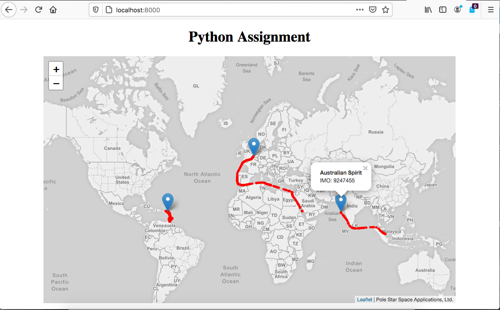
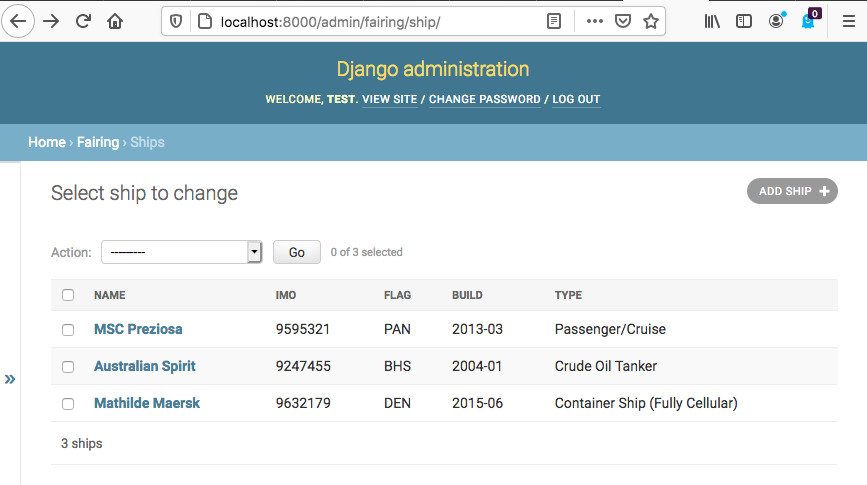
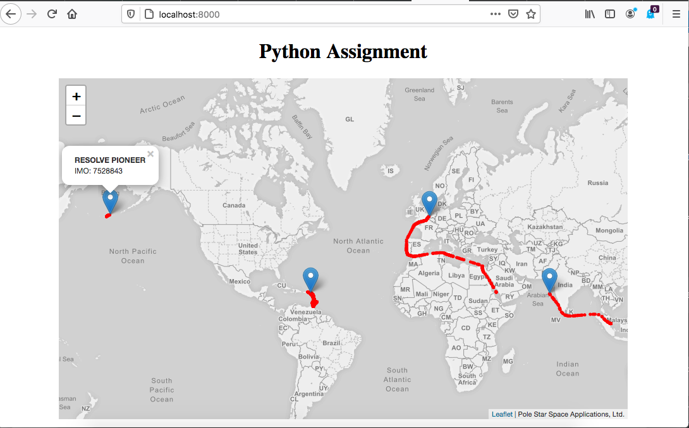

# Storing and visualising ship positional data

This app allows visualising positional data of sea ships
on a map.

The data can be stored by importing CSV files using the comand line as follows:

    code$ python manage.py load_positions <filename1> <filename2> ...
    
 each file containing as many position records as it likes
    
Each row of a positions file has the structure

    <7-digit-imo>, <timestamp-with-tz>, <latitude>, <longitude>
    
    
## Setup

The image should be pulled from the corresponding dockerhub repository and run

    $ docker pull rmendocna/geoship:1.1
    $ docker run -p 8000:8000 rmendocna/geoship:1.1  python manage.py runserver 0.0.0.0:8000
    
Browsing to http://localhost:8000 should deliver the map as it was provided originally, 
with the corresponding ship positions plotted there-in as expected.

 


## (Personal) Notes

 1. Very interesting material to work, grateful already
 2. Having had no exposure to Docker technology before, these might still be in a rough state.
    The gross part of what I have achieved was by adapting 
    https://github.com/NorakGithub/django-docker-alpine 
 
 3. The storage is SQLite3 and no separate "volume" so there is no data persistence once the container is stopped
 4. _Django_ provides an /admin/ interface with which one can, for example, add a Ship - since no endpoint was designed for that purpose.
    The credentials for the /admin/ are _test:test_ 


 4.1. A test data set was added and it can be loaded while the container is running;
      From the Docker Desktop one enters the container CLI and enter the following, roughly identical to the test code.
      First, enter the Ship, either via the /admin/ interface or the shell as follows:
```
    /code # python manage.py shell
    Python 3.8.5 (default, Aug  4 2020, 04:11:56) 
    [GCC 9.3.0] on linux
    Type "help", "copyright", "credits" or "license" for more information.
    (InteractiveConsole)
    >>> from fairing.models import Ship
    >>> new_data = dict(imo='7528843', name='RESOLVE PIONEER', ship_type='1005',)
    >>> new_ship = Ship(**new_data)
    >>> new_ship.save()
    >>> 
```
 Back in the linux shell, we can now import the test data:
```     
    /code # python manage.py load_positions fairing/fixtures/resolve_pioneer.csv 
    Total positions: 396
    /code # 
```
As we reload the index page it then displays the additional positions of one ship on the Bering Sea.


